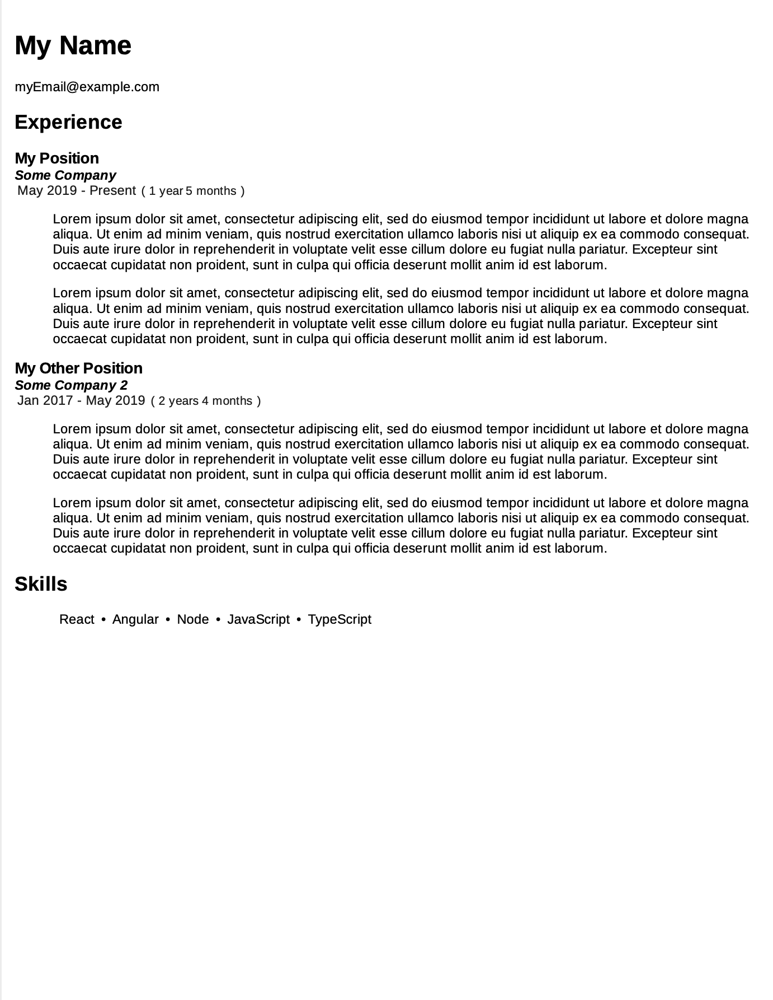

# Resume Builder
Quickly generate resumes in PDF format through docker


## Usage through Docker
This project has been bundled as a Docker image and exists on [https://hub.docker.com/r/ashindlecker/resume-builder](https://hub.docker.com/r/ashindlecker/resume-builder)
```sh
# Pipe resume JSON into docker container and pipe the output to a pdf
cat sample-resume.json | docker run --rm -i ashindlecker/resume-builder > resume.pdf

# View resume
open ./resume.pdf
```

## Resume JSON Object
The sample-resume.json represents a [ResumeDAO](/react/src/dataobjects/ResumeDAO.ts) object. 

```json
{
    "name": "My Name",
    "email": "myEmail@example.com",
    "skills": [
        "React",
        "Angular",
        "Node",
        "JavaScript",
        "TypeScript"
    ],
    "experience": [
        {
            "company": "Some Company",
            "title": "Full Stack Engineer",
            "start": "1/1/2019",
            "duties": [
                "Implemented Docker to containerize microservices",
                "Implemented load balancing through nginx to scale microservices"
            ]
        }
    ]
}
```

## Sample Resume Output
